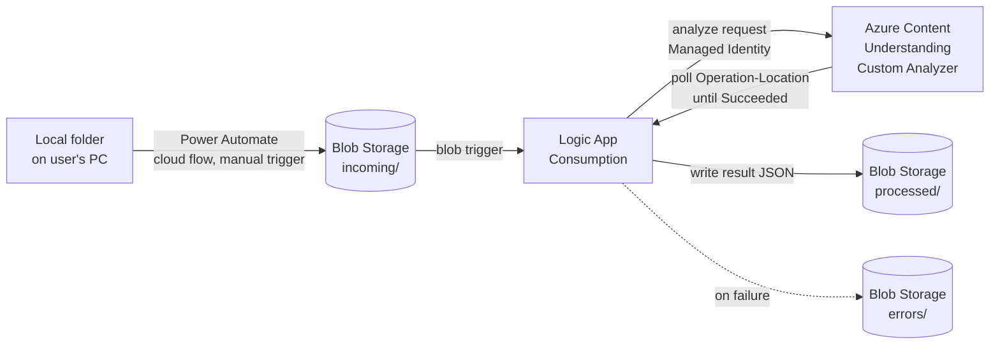

# Fax Ingest & Extraction with Azure Content Understanding

A customer-facing demo that shows how to automate inbound fax (or any scanned document) ingestion using **Power Automate**, **Azure Blob Storage**, **Azure Logic Apps**, and **Azure Content Understanding**. A file dropped from a local folder flows through the pipeline, gets AI-extracted into structured JSON with confidence scores, and lands in a `processed` folder — with no custom application code to run or maintain.

## Architecture



**Flow, step by step**

1. A user (or a scheduled Power Automate flow) picks a file from a local folder and runs a **Power Automate cloud flow** that uploads it to the `incoming` container in Blob Storage. See [power-automate/README.md](power-automate/README.md).
2. The blob's arrival **triggers a Logic App** (Consumption), which reads the file and generates a short-lived read SAS URL for it.
3. The Logic App calls the **Azure Content Understanding** `analyze` REST API using a **custom analyzer** (fax-specific field schema) and its own **system-assigned managed identity** for authentication.
4. Content Understanding processes the document asynchronously. The Logic App **polls** the returned `Operation-Location` until the analysis reaches `Succeeded` (or `Failed`).
5. On success, the Logic App writes the full extraction result as a `.json` file to the `processed` container. On failure, error details are written to the `errors` container.

## Why Content Understanding (vs. Document Intelligence)

This demo intentionally uses a **custom analyzer** with a mix of field extraction methods to show what's new/different vs. classic OCR/Document Intelligence extraction:

| Method | What it does | Example field in this demo |
|---|---|---|
| `extract` | Pulls a value verbatim from the document | `SenderName`, `DateSent` |
| `classify` | Buckets the document into a known category | `DocumentType` (Referral, Invoice, LabResult, ...) |
| `generate` | Uses the underlying model to synthesize an answer that isn't a literal excerpt | `Summary`, `ActionRequired` |

Every field also returns a **confidence score** and **source grounding** (where in the document the value came from), which is what enables straight-through automation with human review only on low-confidence items.

## Repository layout

| Path | Purpose |
|---|---|
| [infra/main.bicep](infra/main.bicep) | Storage account, AI Foundry (Content Understanding) resource + model deployments, Consumption Logic App, API connection, and RBAC |
| [logic-app/workflow.json](logic-app/workflow.json) | The Logic App workflow definition (trigger → analyze → poll → write) |
| [content-understanding/](content-understanding/) | Custom analyzer schema + PowerShell scripts to create the analyzer and test it standalone (independent of the Logic App) |
| [power-automate/README.md](power-automate/README.md) | Step-by-step guide to build the "local folder → Blob" cloud flow |
| [samples/](samples/) | Guidance for sourcing a sample fax document + an example extraction result |
| [presentation/](presentation/) | Dark, Microsoft-branded customer deck with speaker notes |

## Prerequisites

- Azure subscription with access to create a **Microsoft Foundry** resource (`Microsoft.CognitiveServices/accounts`, kind `AIServices`) in **Central US** (this demo's default region — confirm Content Understanding + GPT-4.1-mini deployment availability in your subscription before deploying)
- Azure CLI (`az`) logged in, with the Logic Apps and Cognitive Services resource providers registered
- PowerShell 7+ (for the `content-understanding/*.ps1` scripts)
- A Power Automate license (standard cloud flow connectors: Azure Blob Storage)

## Deploy

```powershell
az group create -n rg-fax-cu-demo -l centralus

az deployment group create `
  -g rg-fax-cu-demo `
  -f infra/main.bicep `
  -p infra/main.parameters.json
```

After the deployment finishes:

1. Run [content-understanding/setup-analyzer.ps1](content-understanding/setup-analyzer.ps1) to configure default model deployments and create the custom analyzer on the new Foundry resource. That endpoint value comes from the main.bicep deployment output foundryEndpoint (the Foundry/AIServices account's endpoint).
2. Run [content-understanding/sample-analyze.ps1](content-understanding/sample-analyze.ps1) against a sample file to confirm the analyzer works, independent of the Logic App.
3. Open the deployed Logic App once in the **Logic App Designer** in the Azure portal — this "touches" the hand-authored [workflow.json](logic-app/workflow.json) so the designer normalizes any connector action shapes, then Save.
4. Follow [power-automate/README.md](power-automate/README.md) to build the upload flow.
5. Drop a sample file into the flow (or directly into the `incoming` container) and watch the Logic App run history; confirm a `.json` file appears in `processed`.

## Enhancements not included in this demo

- **Event Grid trigger** instead of the built-in polling blob trigger, for near-instant (sub-second) pickup instead of ~1 minute polling latency
- Downstream persistence (SQL/Cosmos DB), Teams/email notifications, or system integration (EHR/CRM/RPA)
- Desktop-flow local-folder watching (this demo uses a simple manual-trigger cloud flow instead)

## Presentation

[presentation/Fax-Content-Understanding-Demo.pptx](presentation/Fax-Content-Understanding-Demo.pptx) — dark, Microsoft-branded deck covering the business problem, architecture, step-by-step flow, and benefits, with full speaker notes for a customer-facing walkthrough.
